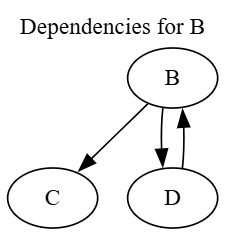

# Package manager
#### Инструмент визуализации графа зависимостей Python-пакетов
*Вариант 25*

## Этапы работы
### Этап 1
Создано минимальное настраиваемое CLI-приложение.

### Этап 2
Реализована основная логика получения данных о зависимостях для их
дальнейшего анализа и визуализации.

### Этап 3
Построен граф зависимостей (с учетом транзитивности) и выполнены
основные операции над ним.

### Этап 4
Выполнены дополнительные операции над графом зависимостей.

### Этап 5
Получено графическое представление графа зависимостей.

## Описание всех функций и настроек
### `config.ini`
```ini
[app]
package_name = requests
version = 2.31.0

# Режим работы:
# real  – работа с реальным репозиторием (URL)
# test  – работа с тестовым репозиторием (файл)
mode = real

# Если mode = real, используется repo_url
repo_url = https://pypi.org/pypi

# Если mode = test, используется test_repo_path
test_repo_path = ./test_repo.txt

# Режим ASCII-дерева:
# true/false, yes/no, 1/0
ascii_tree = false
```

### `test_repo.txt`
```ini
# Список пакетов в формате:
# ПАКЕТ: ЗАВИСИМОСТЬ1 ЗАВИСИМОСТЬ2 ...

A: B C
B: C D
C:
D: B
```

## Запуск приложения
```bash
python main.py # Используется config.ini по умолчанию
# ИЛИ
python main.py --config path/to/your_config.ini # Для указания своего файла конфигурации
# ИЛИ
python main.py --reverse-deps # Для отображения обратных зависимостей
```

## Пример использования
```bash
python ./main.py --config ./test_config.ini --reverse-deps
```

Результат выполнения:

```
package_name = B
version = 1.0.0
mode = test
repo_url = 
test_repo_path = ./test_repo.txt
ascii_tree = false

Граф зависимостей:
Корневой пакет: B

  B -> C, D
  C -> (нет зависимостей)
  D -> B

Обнаружены циклы:
  D -> B

Представление графа в формате Graphviz (DOT):
digraph dependencies {
  label="Dependencies for B";
  labelloc=top;
  node [shape=ellipse];
  "B";
  "C";
  "D";
  "B" -> "C";
  "B" -> "D";
  "D" -> "B";
}

Обратные зависимости для пакета B:
  - D
```

ASCII-дерево:

```
B
├── C
└── D
    └── B (cycle)
```

Граф:

